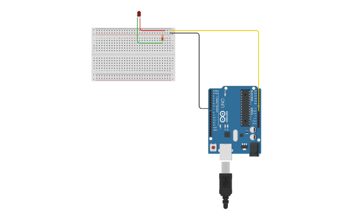
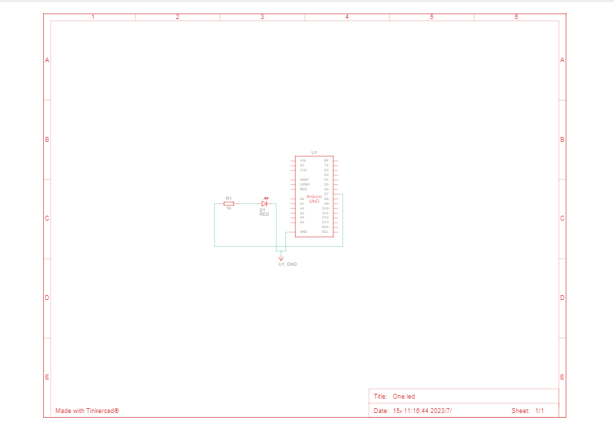
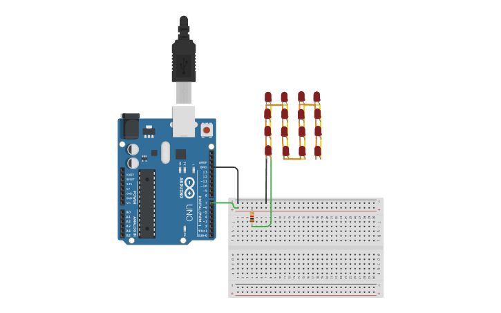
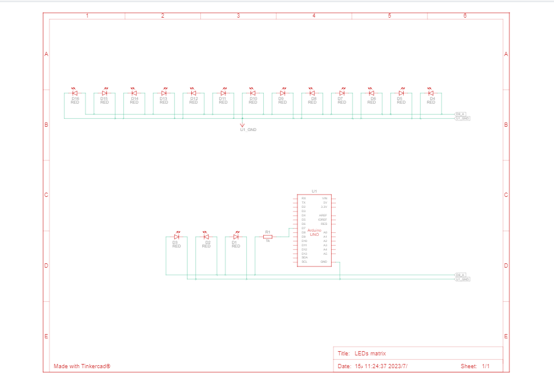

# LEDs with Arduino
Using Arduino, make an LED or an LED matrix blink
# Projects involved:
   1. LED project
   2. Matrix project
# components utilized:
   Components employed: 
   
  1. Arduino Uno R3: 
     The Arduino Uno R3 is an ATmega328P-based microcontroller board. It acts as the primary control unit and offers pins for digital and analog input/output connections and electrical component control.
     
  2. Resistor:
     A resistor is utilized to restrict the current passing through the LED. It provides optimal functioning and safeguards the LED from excessive current.

  3. LEDs:
     A little electrical component called an LED (Light-Emitting Diode) emits light when electricity passes through it. The LED is used in Project 1 as a visual indication or display component.
  4. Matrix:
     The matrix is a grid-like arrangement of LEDs, typically organized in rows and columns. In Project 2, the matrix serves as a display device, capable of showing patterns, images, or scrolling text. 
   **"Because the matrix is ​​not available, we will create one via small LEDs"**

   Materials used:
   1. wires:
     Wires are used to establish electrical connections between the components, allowing the flow of current and signals.
     
  2. Breadboard:
     The breadboard provides a platform for easily prototyping and connecting electronic components. It allows for quick experimentation and temporary connections without the need for soldering.

     
# Project 1 (One LED Blink):

## Making the LED blink requires the actions listed below:

## Circuit diagram:

 

## Schematic View:

 

## Component List:
 .csv)
 
## Project Simulation:

   [One_LED_Simulation](https://www.tinkercad.com/things/9RqAp2i8Kv1)

# Projectt 2 (Matrix Blink):

## Making the Matrix blink requires the actions listed below:

## Circuit diagram:

 

## Component List:
 
 
## Schematic View:

 

## Project Simulation:

   [LEDs_Matrix_Simulation](https://www.tinkercad.com/things/gbCONzobMt5)
